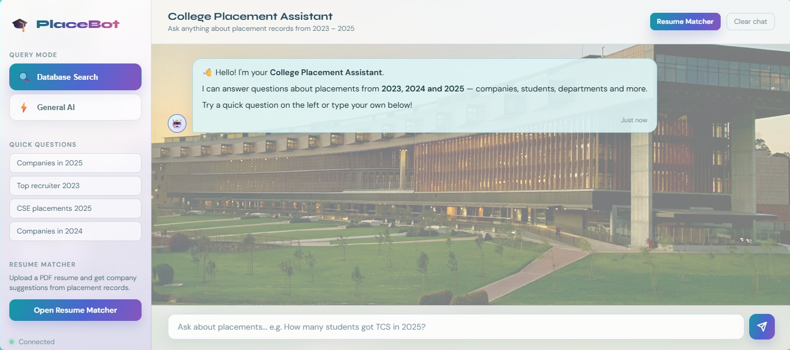
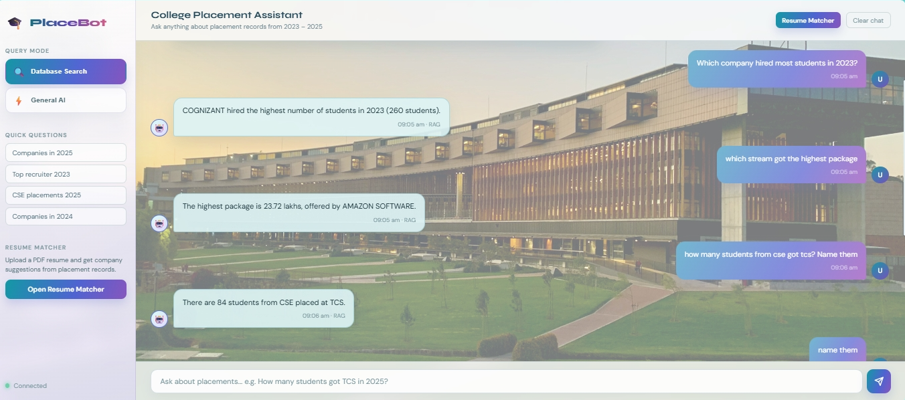
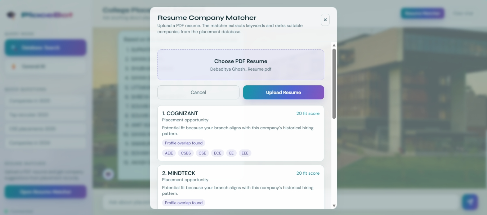
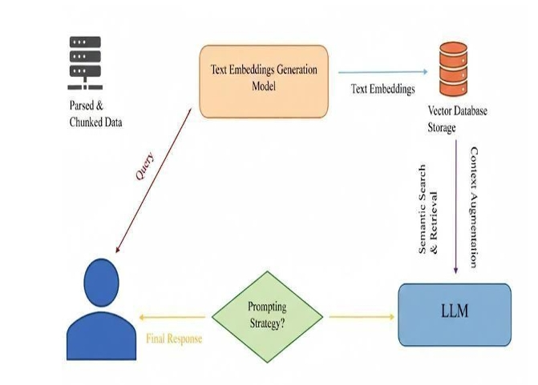

# 🤖 PlaceBot

### AI-Powered Campus Placement Assistant & Resume Analytics System


An AI-powered campus placement assistant that helps students access placement information through natural language conversations and evaluate their resumes against job descriptions. PlaceBot combines Retrieval-Augmented Generation (RAG) with automated resume analytics to provide accurate placement insights and personalized career guidance.

---

## 🚀 Features

- 🤖 AI-powered Placement Chatbot
- 🔍 Retrieval-Augmented Generation (RAG) for accurate responses
- 📄 Automated Resume Analysis
- 📊 Resume-to-Job Fit Score
- 💡 Skill Gap Detection & Improvement Suggestions
- 🗄️ PostgreSQL-based placement database
- ⚡ FAISS Vector Search for semantic retrieval
- 🧠 Google Gemini API integration
- 🌐 FastAPI backend
- 💬 Interactive chat interface

---

## 🛠️ Tech Stack

### Backend
- Python
- FastAPI

### Database
- PostgreSQL
- FAISS Vector Database

### AI & NLP
- Google Gemini API
- Gemini Embeddings
- Retrieval-Augmented Generation (RAG)
- Natural Language Processing (NLP)

### Other Tools
- SQLAlchemy
- PyMuPDF / PDF Parsing
- HTML Web Scraping
- Git & GitHub

---

## 📂 Project Structure

```
Placement-chatbot/
│
├── backend/
├── frontend/
├── agents/
├── screenshots/
│   ├── home.png
│   ├── chat.png
│   ├── resume.png
│   └── architecture.png
│
├── .gitignore
├── README.md
└── placement_db_export.sql
```

---

# 📸 Screenshots

## Home Page



---

## Chat Interface



---

## Resume Analyzer



---

## Architecture



---

## ⚙️ Installation

### Clone the repository

```bash
git clone https://github.com/<your-username>/Placement-chatbot.git
cd Placement-chatbot
```

### Create a virtual environment

```bash
python -m venv venv
```

Activate it

Windows

```bash
venv\Scripts\activate
```

Linux/Mac

```bash
source venv/bin/activate
```

### Install dependencies

```bash
pip install -r requirements.txt
```

### Configure Environment Variables

Create a `.env` file

```env
GEMINI_API_KEY=your_api_key
DATABASE_URL=your_postgresql_connection
```

### Run the project

```bash
uvicorn main:app --reload
```

---

## 📖 How It Works

1. User asks a placement-related question.
2. The query is converted into embeddings.
3. FAISS retrieves the most relevant placement records.
4. Retrieved context is passed to Gemini.
5. Gemini generates an accurate response.
6. Users can also upload resumes for analysis.
7. The system computes a job-fit score and recommends missing skills.

---

## 📸 Features

- Placement statistics retrieval
- Company-wise placement search
- Year-wise placement records
- Student placement search
- Resume matching
- Skill gap analysis
- AI career guidance

---

## 🎯 Future Improvements

- Live placement data scraping
- Authentication system
- Student dashboard
- Admin dashboard
- Placement analytics dashboard
- Multi-college support
- Interview preparation module

---

## 📄 Project Report

This repository is based on the final year B.Tech project:

**PlaceBot: An Intelligent Campus Placement Assistant and Automated Resume Analytics System**

---

## 👨‍💻 Authors

- Debaditya Ghosh
- Nilava Chakraborty
- Debmalya Sadhukhan
- Deeptayan Mukherjee

---

## 📜 License

This project is developed for educational and research purposes.
